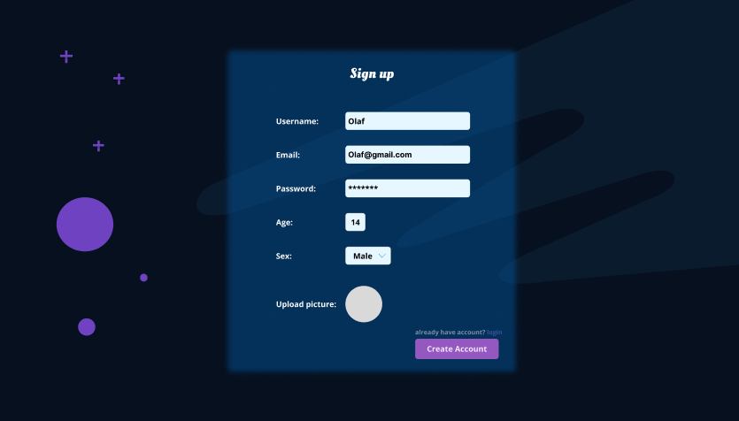
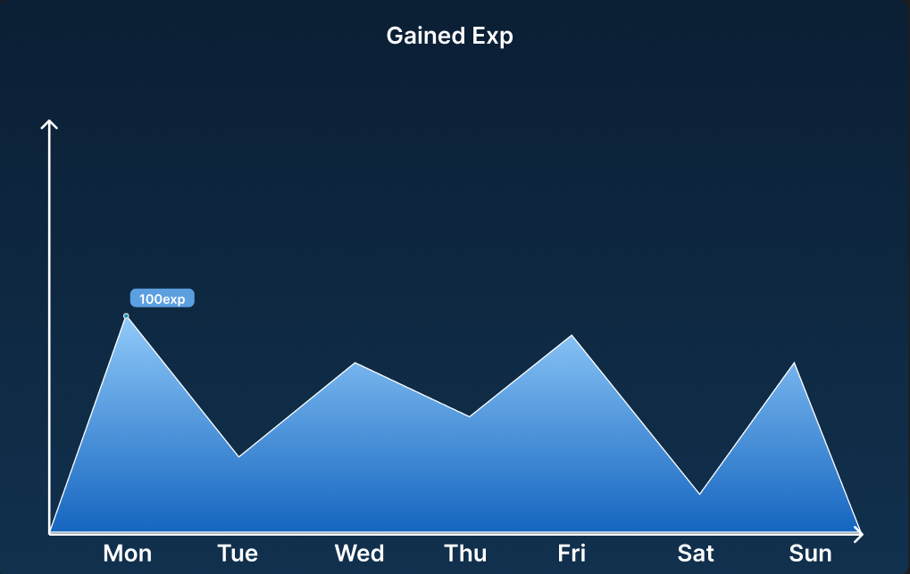
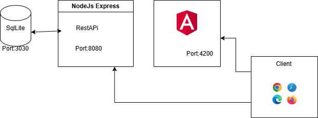

# **Pflichtenheft: `LifeQuest`**

## Inhaltsverzeichnis

- [**Pflichtenheft: `LifeQuest`**](#pflichtenheft-lifequest)
  - [Inhaltsverzeichnis](#inhaltsverzeichnis)
- [**1. Ausgangslage**](#1-ausgangslage)
  - [**1.1 Ist-Situation**](#11-ist-situation)
  - [**1.2 Verbesserungspotenziale**](#12-verbesserungspotenziale)
- [**2. Zielsetzung**](#2-zielsetzung)
    - [**Feature-Set:**](#feature-set)
- [**3. Funktionale Anforderungen**](#3-funktionale-anforderungen)
  - [**3.1 Use Case Überblick**](#31-use-case-überblick)
  - [**3.2 Landingpage**](#32-landingpage)
  - [**3.3 Edit/View Todos**](#33-editview-todos)
  - [**3.4 View Stats**](#34-view-stats)
  - [**3.5 add/remove entries in Calender**](#35-addremove-entries-in-calender)
  - [**3.6 change view in Calander**](#36-change-view-in-calander)
  - [3.7](#37)
  - [4. Nicht-funktionale Anforderungen](#4-nicht-funktionale-anforderungen)
    - [`Usability`: Benutzbarkeitsanforderung](#usability-benutzbarkeitsanforderung)
    - [`Efficiency`: Effizienzanforderung](#efficiency-effizienzanforderung)
    - [`Maintenance`: Wartbarkeits- und Portierbarkeitsanforderung](#maintenance-wartbarkeits--und-portierbarkeitsanforderung)
    - [`Security`: Sicherheitsanforderung](#security-sicherheitsanforderung)
  - [6. Systemarchitektur](#6-systemarchitektur)
    - [6.1 Deployment-Diagramm](#61-deployment-diagramm)
    - [6.2 Datenmodell](#62-datenmodell)

# **1. Ausgangslage**

## **1.1 Ist-Situation**
Most To-Do apps, calendars, and trackers are scattered and not personalized. Additionally, no app truly focuses on helping you improve yourself directly. While Notion is a decent all-in-one tool, it can quickly feel overwhelming, and it doesn’t even have a built-in timetable assistant to help users find time for events or hobbies during the week.

## **1.2 Verbesserungspotenziale**
There are many programs that help you develop further, but most of them lack competition, which can become boring after some time. Moreover, there isn't really an assistant that directly helps users find time during the week for new events or hobbies.

# **2. Zielsetzung**
We aim to develop a personalized "self-improvement" app that combines features of ToDos, calendars, and trackers, but also includes game elements such as a leveling system and competition with other players. Our system will also provide an interactive virtual assistant that helps users with questions.

### **Feature-Set:**
- **Calendar:**
  - change View
  - visualize entries
  - add/remove entries
- **ToDo List:**
  - visualize ToDos
  - add/remove ToDos
  - set Todo Status
- **Level System:**
  - Gain experience points (XP) to level up
  - Lose XP to lose levels
  - Every 10 levels unlock new features

# **3. Funktionale Anforderungen**

## **3.1 Use Case Überblick**

## **3.2 Landingpage**
A new user has no access to the features. If a new user decides to click on one of the features he will be asked to Sign up  

## **3.3 Edit/View Todos**

The user can set change the status of his Todo's and delete them. 

## **3.3 gain/lose levels**

By marking Quests as done, the user gains experience points (XP). But the Quests will be marked as failed if user doesn't complete them in 24 hours.
## **3.4 View Stats**
Each user has a personalized stats page, where they can track their achievements since joining our community, with a leaderboard to motivate them to climb to the top.

To get more details from graphs, the user can hover over any point.

## **3.5 add/remove entries in Calender**
A simple calendar allows users to add events by clicking on the desired date and time. Alternatively, users can click on the "Add" button and fill in the necessary information.

For users to change the view, they need to click on "Weekly" and select their preferences.

## **3.6 change view in Calander**

The Standard view is the weekly View to change. The user can easily change from weekly to daily.
Weekly View: 

Daily View : 

## 3.7 

## 4. Nicht-funktionale Anforderungen

### `Usability`: Benutzbarkeitsanforderung

- Key feutures should be easily accessible
- Fast load times and smooth Transitions
- Giving Users the freedom to change the design

### `Efficiency`: Effizienzanforderung
- To ensure a smooth expirience, the application should respond within 0.2-0.5 seconds
- As we want to have as many users as possible,we will try to minimize memory usage

### `Maintenance`: Wartbarkeits- und Portierbarkeitsanforderung
 The applications should have a better rewarding system and a Virtuell Assistent to support the users development. Above that the application will have the feature, to let the user make an own Calandar View

### `Security`: Sicherheitsanforderung

The software will never change the users data, and the data will be encrypted.System shutdown are allowed as long as it doesn't happen too often and not for too long

## 6. Systemarchitektur

### 6.1 Deployment-Diagramm

### 6.2 Datenmodell

