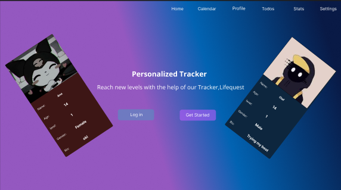
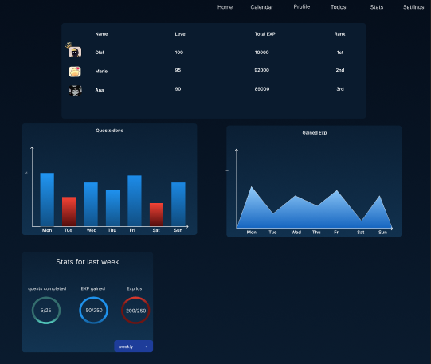

# **Pflichtenheft: `LifeQuest`**

## Inhaltsverzeichnis

- [1. Ausgangslage](#1-ausgangslage)
  - [1.1. Ist-Situation](#11-ist-situation)
  - [1.2. Verbesserungspotenziale](#12-verbesserungspotenziale)
- [2. Zielsetzung](#2-zielsetzung)
- [3. Funktionale Anforderungen](#3-funktionale-anforderungen)
  - [3.1. Use Case Überblick](#31-use-case-überblick)
  - [3.2. Landingpage](#32-landingpage)
    - [3.2.1. GUI-Design](#321-gui-design)
    - [3.2.2. Workflow](#322-workflow)
  - [3.3. AI](#33-ai)
    - [3.3.1. Todos Einführung](#331-todos-einführung)
    - [3.3.2. Quests Einführung](#332-quests-einführung)
    - [3.3.3. Notification Center Einführung](#333-notification-center-einführung)
  - [3.4. Profile](#34-profile)
    - [3.4.1. Reset Password](#341-reset-password)
    - [3.4.2. Change Email and Delete Account](#342-change-email-and-delete-account)
  - [3.5. Todos](#35-todos)
  - [3.6. Stats](#36-stats)
  - [3.7. Kalender](#37-kalender)
- [4. Nicht-funktionale Anforderungen](#4-nicht-funktionale-anforderungen)
  - [`Usability`: Benutzbarkeitsanforderung](#usability-benutzbarkeitsanforderung)
  - [`Efficiency`: Effizienzanforderung](#efficiency-effizienzanforderung)
  - [`Maintenance`: Wartbarkeits- und Portierbarkeitsanforderung](#maintenance-wartbarkeits-und-portierbarkeitsanforderung)
  - [`Security`: Sicherheitsanforderung](#security-sicherheitsanforderung)
  - [`Legal`: Gesetzliche Anforderung](#legal-gesetzliche-anforderung)
- [5. Mengengerüst](#5-mengengerüst)
- [6. Systemarchitektur](#6-systemarchitektur)
  - [6.1. Deployment-Diagramm](#61-deployment-diagramm)
  - [6.2. Datenmodell](#62-datenmodell)

# **1. Ausgangslage**

## **1.1 Ist-Situation**
Most To-Do apps, calendars, and trackers are scattered and not personalized. Additionally, no app truly focuses on helping you improve yourself directly. While Notion is a decent all-in-one tool, it can quickly feel overwhelming, and it doesn’t even have a built-in timetable assistant to help users find time for events or hobbies during the week.

## **1.2 Verbesserungspotenziale**
There are many programs that help you develop further, but most of them lack competition, which can become boring after some time. Moreover, there isn't really an assistant that directly helps users find time during the week for new events or hobbies.

# **2. Zielsetzung**
We aim to develop a personalized "self-improvement" app that combines features of ToDos, calendars, and trackers, but also includes game elements such as a leveling system and competition with other players. Our system will also provide an interactive virtual assistant that helps users with questions.

### **Feature-Set:**
- **Calendar:**
  - Week View
  - Visualize tasks and dates
- **ToDo List:**
  - Visualize ToDos
- **Virtual Assistant:**
  - Introduction to the website
  - Interactive
  - Personalized advice
  - Define weekly goals:
    - Title
    - Duration
    - Frequency
    - Time
  - Propose time slots per week:
    - Accept or modify
  - Notifications
- **Level System:**
  - Gain experience points (XP) to level up
  - Lose XP to lose levels
  - Every 10 levels unlock new features

# **3. Funktionale Anforderungen**

## **3.1 Use Case Überblick**

## **3.2 Landingpage**
Both public and private users will have access to the calendar landing page. They will be welcomed by our AI. Below the welcoming page, there are some showcases of the features available to users.

By clicking on the arrows, additional features will be shown.

By clicking on any icon, the user will be prompted to sign up or log in.

## **3.3 AI**
If the user is new and decides to create an account, they will be introduced by our AI. After clicking the "Start" button, the user will be forwarded to the main page with an explanation. However, if the user is not interested in the introduction, they can skip it.

**Todos Introduction:**

**Quests Introduction:**

**Notification Center:**

## **3.4 Profile**
In the profile tab, users can get an overview of their progress and activity.

When the user clicks on "Settings," they will be forwarded to the settings page where they can:
- Reset password
- Change email
- Delete account

### **3.4.2 Change Email and Delete Account**
To change the email, the user must enter the new email and a verification code sent to their email. When clicking the delete button, the user will be asked for confirmation before deleting their account.

### **3.4.1 Reset Password**
If the user forgets their password, they can click on "Reset." An email with a verification code will be sent. The user will need to enter the code and their new password.

## **3.5 Todos**
For better task management, the user can navigate to the ToDo page. In the "Deadlines" section, tasks with the nearest deadlines will be displayed. Additionally, there is an overview of completed, pending, and overdue tasks.

## **3.6 Stats**
Each user has a personalized stats page, where they can track their achievements since joining our community, with a leaderboard to motivate them to climb to the top.

To get more details from graphs, the user can hover over any point.

## **3.7 Kalender**
A simple calendar allows users to add events by clicking on the desired date and time. Alternatively, users can click on the "Add" button and fill in the necessary information.

For users to change the view, they need to click on "Weekly" and select their preferences.

## 4. Nicht-funktionale Anforderungen

Nicht-funktionale Anforderungen beschreiben Anforderungen an das System, die nicht-fachlicher Natur sind, jedoch entscheidend zur Anwendbarkeit des Systems beitragen. Sie definieren beispielsweise Qualitätsanforderungen, Sicherheitsanforderungen oder Performanceanforderungen.

Nicht-funktionale Anforderungen definieren grundlegende Eigenschaften eines Systems, die im Architekturentwurf berücksichtigt werden müssen. Da diese Anforderungen auch die Entwicklungskosten beeinflussen (können), müssen sie messbar beschrieben werden.

- FALSCH: Das System muss schnell sein.
- RICHTIG: Daten müssen spätestens innerhalb von 500 ms zurückgegeben werden.

Zur einfachen Strukturierung der Anforderungen werden diejenigen Anforderungen, die nicht eindeutig zu den funktionalen Anforderungen gehören, den nicht-funktionalen Anforderungen zugeordnet.

Hier ein Überblick über mögliche nicht-funktionale Anforderungen:

### `Usability`: Benutzbarkeitsanforderung

- Wie muss die Software beschaffen sein, damit die Zielgruppe gerne damit arbeitet?
- Beispiel:
  - Die Software soll dem Erscheinungsbild anderer Produkte des Herstellers entsprechen.

### `Efficiency`: Effizienzanforderung

- Hier geht es sowohl um Laufzeit- als auch um Speichereffizienz. Was wird unter dem sparsamen Einsatz dieser Ressourcen verstanden?
- Beispiel:
  - Die Berechnung darf nicht länger als 0,25 Sekunden dauern.

### `Maintenance`: Wartbarkeits- und Portierbarkeitsanforderung

- Welcher Grad an Änderbarkeit wird gefordert? Hier werden, soweit wie möglich, kommende Anpassungen und Erweiterungen vorhergesehen.
- Beispiel:
  - Das Produkt soll später auch in englischer Sprache verfügbar sein.

### `Security`: Sicherheitsanforderung

- Zu den Sicherheitsanforderungen gehören die Aspekte Vertraulichkeit, Datenintegrität und Verfügbarkeit.
  - Wie sehr müssen die Daten vor dem Zugriff durch Dritte geschützt werden?
  - Ist es entscheidend, die Korrektheit der erfassten Daten und ihre Konsistenz zu gewährleisten?
  - Dürfen Systemausfälle vorkommen?
- Beispiel:
  - Das System muss gewährleisten, dass Daten nie verändert werden können.

### `Legal`: Gesetzliche Anforderung

- Welche Standards und Gesetze müssen beachtet werden?
- Beispiel:
  - Das Produkt muss die ISO 9000 Norm erfüllen.

## 5. Mengengerüst

Zur Abschätzung der aufkommenden Datenmengen und damit verbunden der notwendigen Infrastruktur, um die nötige Performance zu erzielen, ist ein Mengengerüst zu erstellen. Mögliche Fragestellungen:

- Wieviele User werden erwartet?
- Wieviele Daten pro User werden erwartet?
- Mit welcher Anfrage-Frequenz wird gerechnet?

## 6. Systemarchitektur

### 6.1 Deployment-Diagramm
- Auflistung der Softwarekomponenten in einem Verteilungsdiagramm (typisch: Client - Server - Datenbank).
- Beispiel:

### 6.2 Datenmodell

- Wahlweise ER-Diagramm oder objekt-orientiertes Klassendiagramm

